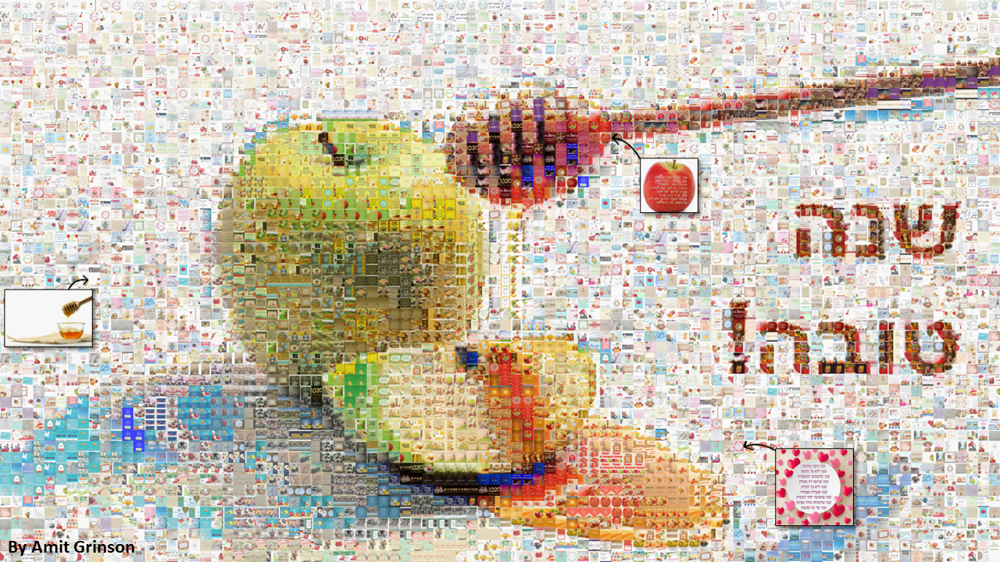

### 'Great Year' photomosaic

This project contains part of the code and instructions on making the 'Good year' photo mosiac from generic 'good year' wishes found on Google.

The process was pretty straight forward:

1. Scrape Google images for the search key 'blessing for the new year' in Hebrew — You can find the code in [this repo](collect_images.py) or a good tutorial I used by [Chris Zaire](https://levelup.gitconnected.com/how-to-download-google-images-using-python-2021-82e69c637d59). Essentially you use Selenium to open all image results on Google search and download them using a loop.

2. Create the photo mosiac — I tried 1-2 packages/explanations and found [this tutorial by hanzhi713](https://github.com/hanzhi713/image-collage-maker) to be with the best results. Just follow along the setup and play with the paramers to get the result you want.

3. After the photomosaic was created I added a 'zoom effect' for 3 images to make it a little clearer what's going on.

That's it, enjoy and have a great year!

### שנה טובה!

